## 💡🍮 hyzu

OpenGL lighting project made from scratch, destined to be a volumetric light implementation.

Includes:

* Blinn-Phong model.
* Multiple light sources: directional, point, spotlight.
* Normal mapping.
* Shadow mapping with the use of a Depth map rendered from the light's point of view projected in perspective.
* HDR, Gamma Correction and Grain as Post Processing effects.
* Anti Aliasing, Blending, Depth Testing and a Skybox implementation.

### 📷Satisfying before & after pictures:

This is how the model looked w/ no lighting & no post processing effects. The only thing I added was the skybox:

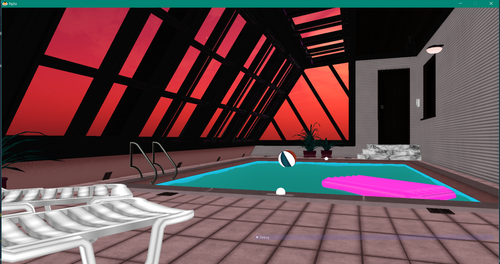

> yikes!

First thing first, I implemented the Blinn-Phong lighting in the Fragment shader using only a directional light. I also used Normal mapping to get better specular highlights. This is the result:

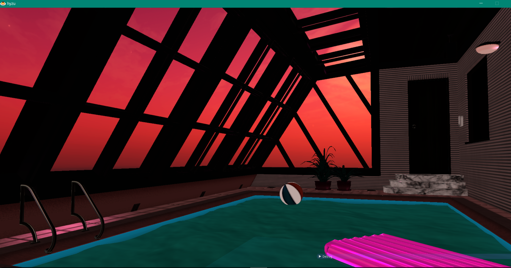

The colors are still crunchy and that is because there is no Gamma Correction. I added a different shader for Post Processing with Gamma Correction & HDR. Using another framebuffer to render a scene into a texture, and then applying the Post Processing lead to this result:

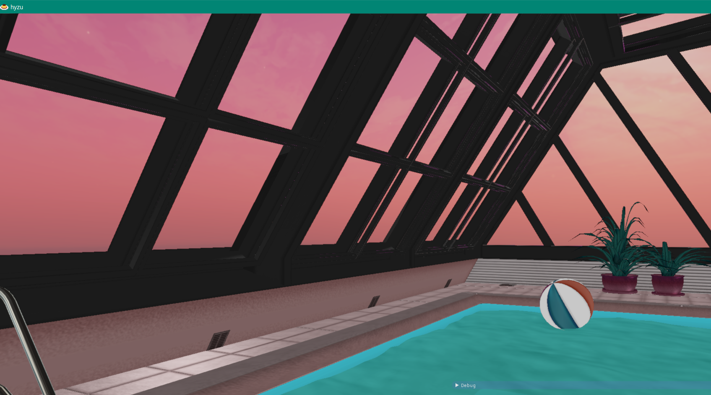

>the colors are no longer oversaturated and they look pretty ok!

Time for shadows! I needed another framebuffer, a depth one, that I rendered the whole scene in, but from my directional light's point of view (which is using a perspective projection). Again, the result of the render is put into a texture. Debugging the result I got this:

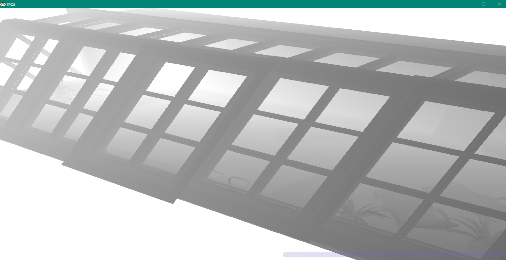

>spooky!

Projecting the texture onto my model looks something like this:

Now adding the computed shadow to my directional light's diffuse & specular components, I got this:

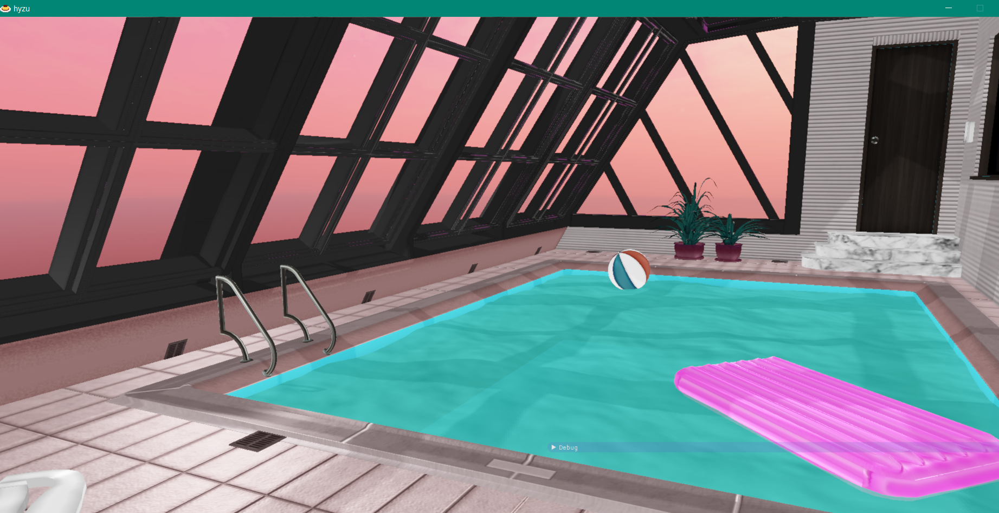

>gorg

The lighting is pretty boring tho, so I added two point lights near the ends of the pool, and two spotlights that start from the lamps on the side, so it can fit the pool vibe more. Here they are:

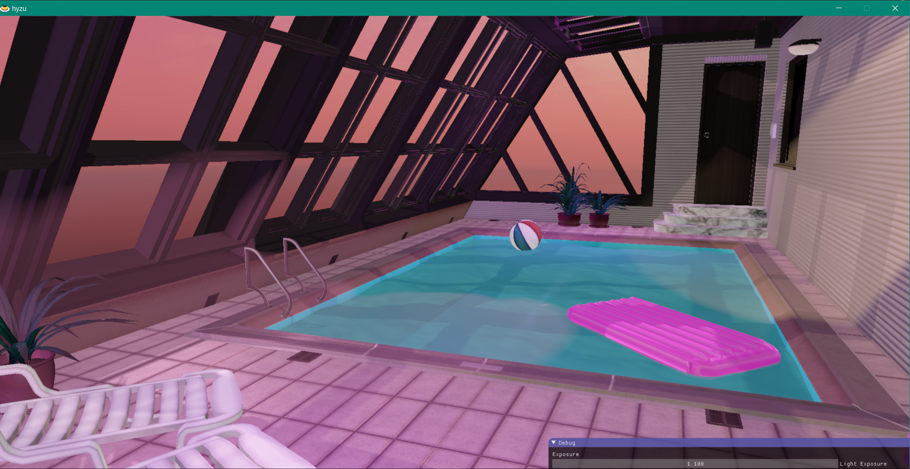

One more thing I added was a Grain effect, again in my Post Processing shaders.

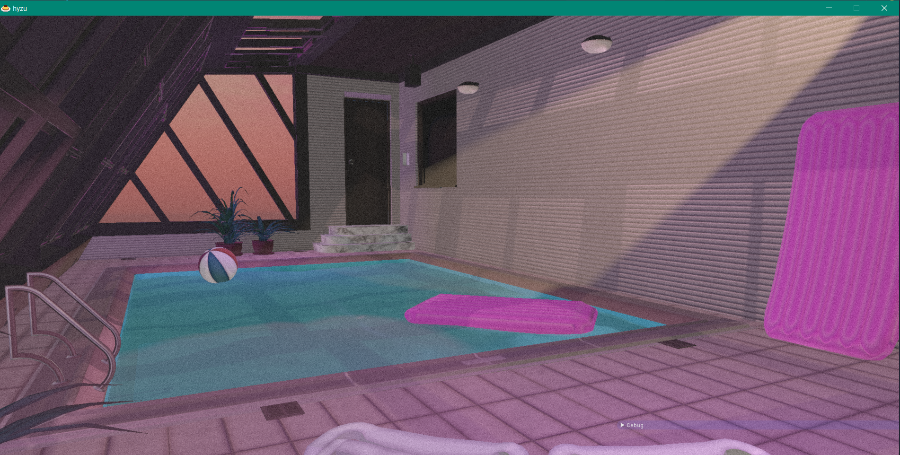
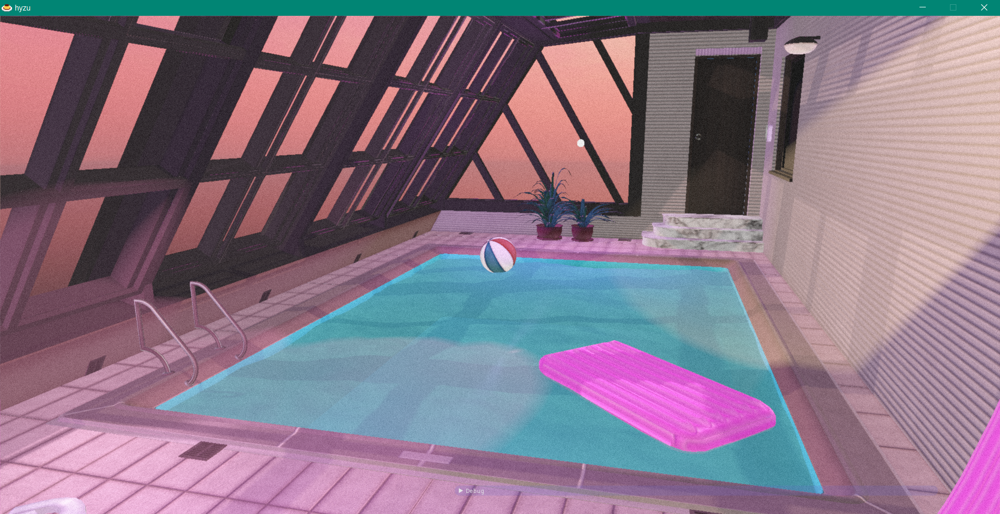

Now everything is set for some much needed Volumetric light & reflections/refractions.

For Volumetric lighting, I used the occlusion texture & ray marching technique.

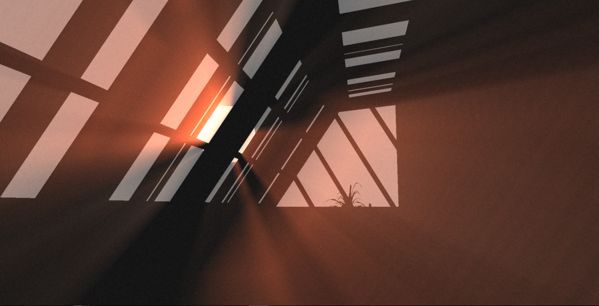
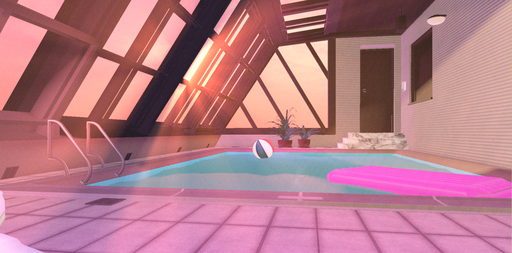

### 📷Video of the final result:

### New GUI with Scene Management:

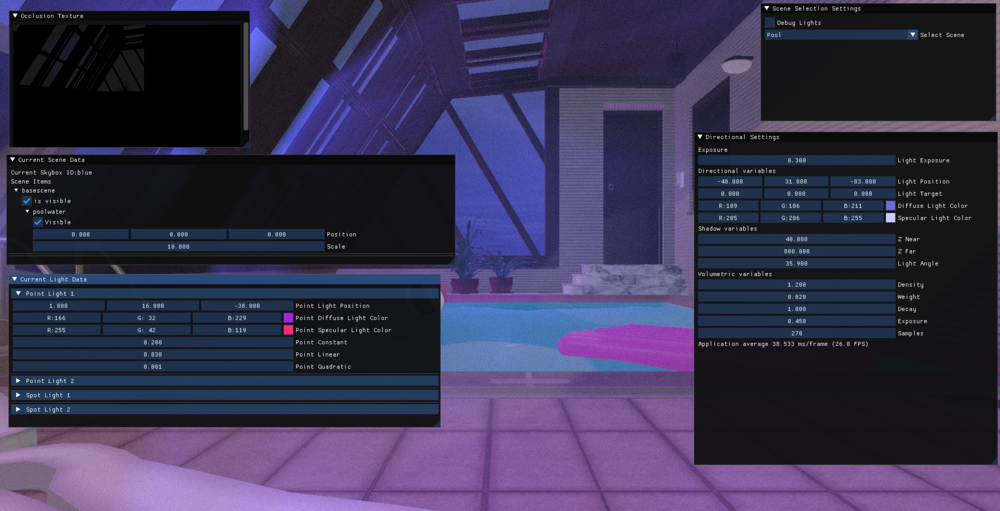